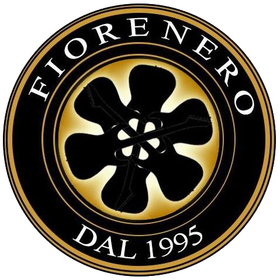

<h1 align="center">Fiore Nero Website</h1>

[View the live project here.](https://tizianocoppoli.github.io/MS1-rock-band/)

This is the main website for Fiore Nero - Rock Band. It is designed to be responsible and accessible on multiple devices, making it easy to navigate for fans and customers.

<h2 align="center"></h2>

## User Experience (UX)

- ### User stories

  - #### First Time Visitor Goals

    1. As a First Time Visitor, I want to understand the music genre and learn about the band quickly.
    2. As a First Time Visitor, I want to easily navigate throughout the site to find the closest concert date.
    3. As a First Time Visitor, I want to see the band's video to understand if I like music.

  - #### Returning Visitor Goals

    1. As a Returning Visitor, I want to know more about the album released.
    2. As a Returning Visitor, I want to find the best way to contact the band with any questions I may have.
    3. As a Returning Visitor, I want to find community links.

  - #### Frequent User Goals
    1. As a Frequent User, I want to check to see if there are any new releases.
    2. As a Frequent User, I want to check to see if there are any new items to shop in the store section.
    3. As a Frequent User, I want to sign up for the Newsletter to stay updated with any new concert date.

- ### Design

  - #### Colour Scheme
    - The two main colours used are black and yellow, the logo's colours.

  - #### Typography
    - The Source Sans Pro font is the main font used throughout the whole website, with Sans Serif as the fallback font in a case for any reason the font isn't being imported into the site correctly.
    - Raleway is a clean font used for headings.

  - #### Imagery
    - Imagery is important. The large background hero image is a real picture taken during a concert and is designed to be striking and catch the user's attention. It also has a modern, energetic aesthetic.

* ### Wireframes

  - Home Page Wireframe - [View](assets/images/doc/home.pdf)
  - Tablet Wireframe - [View] (assets/images/doc/tablet.png)
  - Mobile Wireframe - [View](assets/images/doc/mobile.png)

## Features

- Responsive on all device sizes

- Interactive elements

## Technologies Used

### Languages Used

- [HTML5](https://en.wikipedia.org/wiki/HTML5)
- [CSS3](https://en.wikipedia.org/wiki/Cascading_Style_Sheets)

### Frameworks, Libraries & Programs Used

1. [Bootstrap 5.0.0:](https://getbootstrap.com/docs/5.0/getting-started/introduction/)
   - Bootstrap was used to assist with the responsiveness and styling of the website.
2. [Google Fonts:](https://fonts.google.com/)
   - Google fonts were used to import the "Raleway" and "Source Sans Pro" font which is used on all pages throughout the project.
3. [Font Awesome:](https://fontawesome.com/)
   - Font Awesome was used on all pages throughout the website to add icons for aesthetic and UX purposes.
4. [jQuery:](https://jquery.com/)
   - jQuery came with Bootstrap to make the navbar responsive but was also used for the smooth scroll function in JavaScript.
5. [Git](https://git-scm.com/)
   - Git was used for version control by utilizing the Gitpod terminal to commit to Git and Push to GitHub.
6. [GitHub:](https://github.com/)
   - GitHub is used to store the projects code after being pushed from Git.
7. [Photoshop:](https://www.adobe.com/ie/products/photoshop.html)
   - Photoshop was used to create the logo, resizing images and editing photos for the website.
8. [Balsamiq:](https://balsamiq.com/)
   - Balsamiq was used to create the [wireframes](assets/images/doc/home.pdf) during the design process.

## Testing

The W3C Markup Validator and W3C CSS Validator Services were used to validate every page of the project to ensure there were no syntax errors in the project.

- [W3C Markup Validator](https://jigsaw.w3.org/css-validator/#validate_by_input) - [Results](assets/images/doc/html-valid.png)
- [W3C CSS Validator](https://jigsaw.w3.org/css-validator/#validate_by_input) - [Results](assets/images/doc/css-valid.png)

### Testing User Stories from User Experience (UX) Section

- #### First Time Visitor Goals

  1. As a First Time Visitor, I want to easily understand the genre of the music.

     1. Upon entering the site, users are automatically greeted with a clean and easily readable navigation bar to go to their choice section. Underneath, there is a Hero Image with the text "Unforgettable Rock Music".
     2. The main points are made immediately with the hero image.
     3. The user can scroll down to discover more.

  2. 2. As a First Time Visitor, I want to be able to easily navigate throughout the site to find the closest concert date.

     1. The site has been designed to be fluid and never to entrap the user. At the top, there is a clean navigation bar. Each link describes the page they will end up at clearly.
     2. The navbar doesn't hide so that the user can go to another section at any moment.
     3. After the hero image, there is the gig section where the user can find the next dates.

  3. As a First Time Visitor, I want to see a video of the band to understand if I like the music.

     1. Once the new visitor has viewed the callout and the concert dates, they can play an embedded video.  

- #### Returning Visitor Goals

  1. As a Returning Visitor, I want to know more about the album released.

     1. In the music section, the user can see the album released.
     2. There is the possibility to buy the previous albums and to pre-order the next one.

  2. As a Returning Visitor, I want to find the best way to get in contact with the band with any questions I may have.

     1. The navigation bar highlights the "Contact" Page.
     2. The user is provided with the email addresses for info, bookings, and press.
     3. Alternatively, the user can directly fill out the form on the page.
     4. Whichever link they click, it will be open up in a new tab to ensure the user can easily get back to the website.
     5. The email button is set up to automatically open up your email app and autofill their email address in the "To" section.

  3. As a Returning Visitor, I want to find community links.
     1. The YouTube, Facebook, Soundcloud, Instagram, Spotify, and Twitter pages can be found at the footer and open a new tab.    

- #### Frequent User Goals

  1. As a Frequent User, I want to check to see if there are any new release.

     1. The user would already be comfortable with the website layout and can easily go to the music section to check the most recent album.

  2. As a Frequent User, I want to check to see if there are any new items to shop in the store section.

     1. The user would already be comfortable with the website layout and can easily go to the shop section to see the new items to buy.

  3. As a Frequent User, I want to sign up to the Newsletter so that I am emailed any new concert date.

     1. In the callout, under the headline, the user can see the "Subscribe" button and is prompted to Enter their email address.
     2. There is a "Submit" button to the right-hand side of the input field, located close to the field and can easily be distinguished.

### Further Testing

- The Website was tested on Google Chrome and Microsoft Edge.
- The website was viewed on a variety of devices such as Desktop, Laptop, iPhone7, iPhone 8 & iPhoneX, iPad.
- A large amount of testing was done to ensure that all pages were linking correctly.
- Band members were asked to review the site to point out any bugs and/or user experience issues.

### Known Bugs

- The site doesn't fully support screen sizes less than 320px.

### Solved Bugs

- For small screen size (375px) there was an extra padding by default in the bootstrap row solved with custom css:
```
.row > * {
  padding-right: 0px;
  padding-left: 0px;
}
```

- The logo doesn't look good in rotated small devices, solved by hiding in small and medium screens:
```
<div class="logo-holder d-none d-lg-block">
                                
                            </div>
```

## Deployment

### GitHub Pages

The project was deployed to GitHub Pages using the following steps...

1. Log in to GitHub and locate the [GitHub Repository](https://github.com/tizianocoppoli/MS1-rock-band)
2. At the top of the Repository (not top of page), locate the "Settings" Button on the menu.  
3. Scroll down the Settings page until you locate the "GitHub Pages" Section.
4. Under "Source", click the dropdown called "None" and select "Master Branch".
5. The page will automatically refresh.
6. Scroll back down through the page to locate the now published site [link](https://tizianocoppoli.github.io/MS1-rock-band/) in the "GitHub Pages" section.

### Forking the GitHub Repository

By forking the GitHub Repository we make a copy of the original repository on our GitHub account to view and/or make changes without affecting the original repository by using the following steps...

1. Log in to GitHub and locate the [GitHub Repository](https://github.com/tizianocoppoli/MS1-rock-band)
2. At the top of the Repository (not top of page) just above the "Settings" Button on the menu, locate the "Fork" Button.
3. You should now have a copy of the original repository in your GitHub account.

### Making a Local Clone

1. Log in to GitHub and locate the [GitHub Repository](https://github.com/tizianocoppoli/MS1-rock-band)
2. Under the repository name, click "Clone or download".
3. To clone the repository using HTTPS, under "Clone with HTTPS", copy the link.
4. Open Git Bash
5. Change the current working directory to the location where you want the cloned directory to be made.
6. Type `git clone`, and then paste the URL you copied in Step 3.

```
$ git clone https://github.com/YOUR-USERNAME/YOUR-REPOSITORY
```

7. Press Enter. Your local clone will be created.

```
$ git clone https://github.com/YOUR-USERNAME/YOUR-REPOSITORY
> Cloning into `CI-Clone`...
> remote: Counting objects: 10, done.
> remote: Compressing objects: 100% (8/8), done.
> remove: Total 10 (delta 1), reused 10 (delta 1)
> Unpacking objects: 100% (10/10), done.
```

Click [Here](https://help.github.com/en/github/creating-cloning-and-archiving-repositories/cloning-a-repository#cloning-a-repository-to-github-desktop) to retrieve pictures for some of the buttons and more detailed explanations of the above process.

## Credits

### Code

- [Bootstrap](https://getbootstrap.com/docs/5.0/getting-started/introduction/): Bootstrap Library used throughout the project mainly to make site responsive using the Bootstrap Grid System.
- Code for navbar animation taken from [Wrapbootstrap] (https://wrapbootstrap.com/)
- Code for buttons taken from [Wrapbootstrap] (https://wrapbootstrap.com/)
- Code for album animation taken from [Wrapbootstrap] (https://wrapbootstrap.com/)
- Code for merch masks taken from [Wrapbootstrap] (https://wrapbootstrap.com/)
- Code for modal taken from [Getbootstrap] (https://getbootstrap.com/docs/4.0/components/modal/)

### Content

- All content was written by the developer.

- Psychological properties of colours text in the README.md was found [here](http://www.colour-affects.co.uk/psychological-properties-of-colours)

### Media

- All Images were created by the developer.

### Acknowledgements

- My Mentor for continuous helpful feedback.

- Tutor support at Code Institute for their support.
